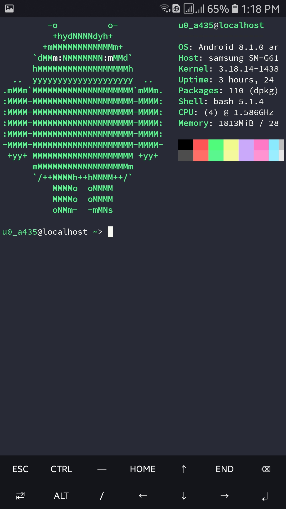
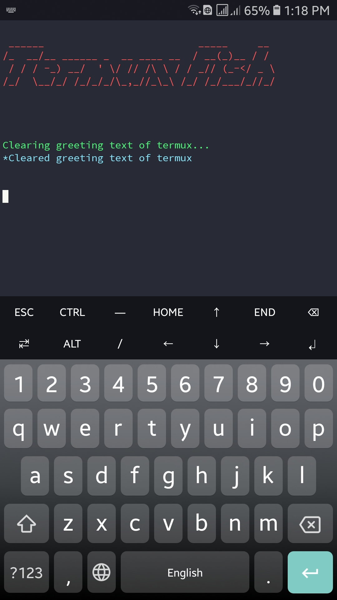

# Termux Mint
This program will (permanently) install MintOS in termux and change the look of your termux homepage using neofetch. MintOS has auto completion,syntax highlighting and many more features.
<br>
For more info check fish documentation by clicking <a href="https://fishshell.com" target="_blank">here</a>
<br>
New look of termux:

<br><br>
The script:

<br><br>
<i>To install, type this: :</i>
```bash
pkg update && pkg upgrade -y && pkg install git -y && git clone https://github.com/Blank94855/termux-mint.git && cd termux-mint && chmod +x script.sh && ./script.sh
```
<br><br>
1)Update termux:
```bash
pkg update && pkg upgrade -y
```
2)Install git
```bash
pkg install git -y
```
3)Clone this repo
```bash
git clone https://github.com/Blank94855/termux-mint
```
4)Change dir to the repo and give executable permissions to script.sh
```bash
cd termux-mint && chmod +x script.sh
```
5)Run the script
```bash
./script.sh
```
6)Exit termux and enter again.
<br><br>
If you want to revert back to your previous shell type this command:<br>
```bash
chsh -s bash
```
